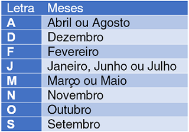
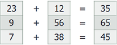

# Introdução à Programação com Java ☕️

Este material se baseia na [apostila de Introdução à Programação com JavaScript](http://timarcosdias.github.io/ilp/) e aborda os principais conteúdos da programação estruturada com a linguagem de programação Java. E, já que mencionamos JavaScript, se você está começando em programação por agora, entenda que **Java e JavaScript são duas linguagens de programação completamente diferentes**.

No final deste material existem listas de exercícios para a prática dos fundamentos aprendidos em cada uma das seções. Se você está começando agora, a recomendação é: resolva todos os exercícios, se possível, até mais de uma vez.

Não tenha pressa. Leia com atenção e seja persistente. A programação de computadores pode ser intimidadora, mas, a cada passo que der, você se sentirá cada vez mais motivado a entrar nesse mundo.

Bons estudos!

## Sumário


## 1 Funções (Métodos)

Uma função é um procedimento armazenado, um bloco de código que pode ser executado a partir de um ponto específico de um programa. Na linguagem Java, as funções são chamadas de **métodos**, isso porque a linguagem Java é orientada a objetos e baseada em classes. Em linguagens como esta, um método define um comportamento específico para uma classe, por isso leva esse nome.

Utilizaremos os termos **função** e **método** de maneira intercalada e equivalente. Não estranhe quando encontrar um ou outro. Ainda estamos falando da mesma coisa.

Funções geralmente possuem um nome, uma lista de parâmetros e um retorno, mas também podem não possuir nenhum dos três. A função a seguir não retorna nada nem possui parâmetros:

```java
static void digaOla() {
    System.out.println("Olá!");
}
```

A declaração de uma função deve sempre acompanhar um tipo de retorno, mesmo que ela não retorne nada. Como a função `digaOla` não retorna nada, apenas imprime um valor no console, seu tipo de retorno é `void`.

Como quase toda função, a função `digaOla` possui um nome e acompanha um par de parênteses, onde poderíamos informar **parâmetros**. Falaremos sobre eles em breve. Em seguida, abre-se um bloco, utilizando chaves, que descreve o procedimento a ser realizado pela função.

A palavra-chave `static` garantirá que a função pertença à classe atual, eliminando a necessidade de criação de um objeto para que a função seja utilizada.

O código acima apenas realiza a declaração da função. Para que ela seja utilizada, é necessário invocá-la a partir da função `main` ou a partir de outra função que seja indiretamente invocada por `main`. Teste o seguinte exemplo para visualizar a função `digaOla` sendo invocada:

```java
// Main.java
class Main {

    public static void main(String[] args) {
        digaOla();
    }

    static void digaOla() {
        System.out.println("Olá!");
    }
}
```

### 1.1 Parâmetros

Um parâmetro (ou argumento) representa um valor a ser informado para que seja processado pelo método. Um método pode não possuir parâmetros ou possuir vários parâmetros. Cada parâmetro deve ser acompanhado de seu respectivo tipo. 

Um parâmetro pode ser um valor de tipo primitivo, como `int` ou `char`, ou um objeto, como `String` ou qualquer outro tipo criado pelo usuário, inclusive vetores. Observando o método `main`, podemos perceber que ele possui um parâmetro chamado args, que é um vetor do tipo `String`:

```java
public static void main(String[] args){ }
```

Poderíamos definir um método para exibir o resultado da soma de dois números inteiros, utilizando dois parâmetros, da seguinte forma:

```java
static void imprimeSoma(int n1, int n2){
    System.out.println("O resultado da soma é: " + (n1+n2));
}
```

Em seu método `main`, invoque o método `imprimeSoma` da seguinte forma para visualizar o resultado `8`:

```java
imprimeSoma(3, 5);
```

#### Varargs

Na seção anterior, criamos uma função para imprimir o resultado da soma de dois inteiros. Mas como lidar com situações em que necessitamos de um número indefinido de parâmetros, como em uma função que possa somar um número ilimitado de inteiros?

A solução para este problema na linguagem Java se chama **varargs**, de argumentos variáveis.

Varargs são identificados por reticências (`...`) na declarção do parâmetro e possibilitam estabelecer uma variável que represente um número indeterminado de parâmetros que são tratados como um vetor dentro da função. No exemplo abaixo, a função `somaVariavel(int... termos)` imprimirá o resultado da soma de quantos termos forem passados por parâmetro:

```java
static void somaVariavel(int... termos) {
    int resultado = 0;
    for(int i = 0; i < termos.length; i++) {
        resultado += termos[i];
    }
    System.out.println(resultado);
}
```

Em seu método `main`, invoque o método `somaVariavel` das seguintes formas:

```java
somaVariavel(1,2,3);
somaVariavel(1,2,3,4,5);
somaVariavel(1,2,3,4,5,6,7,8);
```

Você deve ter visto os resultados `6`, `15` e `36`.

A grande vantagem desse recurso é que não é necessário para quem invoca a função construir um vetor com os parâmetros desejados.

### 1.2 Retorno

O retorno de uma função é o valor devolvido por ela, geralmente resultado de um processo realizado pela própria função. Por exemplo, qual seria o retorno esperado para uma função chamada `soma`, que realize a soma de dois parâmetros do tipo inteiro? Certamente, um valor do tipo inteiro:

```java
static int soma(int a, int b) {
    return a + b;
}
```

O comando `return` é utilizado para finalizar a execução de uma função e retornar um valor resultante. Porém, é necessário que o valor retornado seja compatível com o tipo definido ao lado esquerdo do nome da função. Veja que no exemplo acima, definimos o tipo de retorno da função `soma` como `int` e no corpo da função estamos retornando o resultado de `a + b`, que certamente será um número inteiro.

Toda função possui um tipo de retorno. As que não retornam nada utilizam `void` para essa finalidade.

Em seu método `main`, invoque o método `soma` da seguinte forma:

```java
int resultado = soma(5, 7);
System.out.println(resultado); 
```

Se executou o código acima, você deve ter obtido o valor `12` impresso no console. A variável `resultado` foi criada apenas para armazenar o retorno da função `soma`. Como o nosso propósito era apenas escrever o retorno da função, poderíamos ter simplificado para:

```java
System.out.println(soma(5,7)); 
```

Como falamos há pouco, embora didática, a função `soma(int a, int b)` não é um dos exemplos mais úteis de funções. E se pudéssemos construir uma função que converta uma temperatura de Celsius para Fahrenheit, para que não precisemos nos lembrar da fórmula a cada vez que for necessário realizar uma conversão?

```java
static float celsiusParaFahrenheit(float temperaturaCelsius) {
    return (9 * temperaturaCelsius + 160) / 5;
}
```

Em seu método `main`, invoque-a da seguinte forma:

```java
System.out.println(celsiusParaFahrenheit(32)); 
```

O valor impresso deverá ser `89.6`.

#### Utilizando o `return` para interromper uma função

Como foi dito anteriormente, o comando `return`, além de retornar um valor para quem invoca a função, finaliza a execução da função em questão.

Considere a seguinte situação: desejamos construir uma função que retorne o menor divisor inteiro de um número inteiro qualquer, desconsiderando `1`. Podemos utilizar uma estrutura de repetição para testar possíveis divisores entre `2` e a metade do número em questão e retornar o primeiro divisor encontrado.

```java
static int menorDivisor(int numero) {
    for(int i = 2; i <= numero / 2; i++) {
        if(numero % i == 0) {
            return i;
        }
    }
    return numero;
}
```

Perceba que, no exemplo acima, o comando `return` fará com que a função seja interrompida antes mesmo de a estrutura de repetição chegar a seu fim, caso um divisor válido seja encontrado. Caso não seja encontrado nenhum divisor, após o término da estrutura de repetição, a função retornará o próprio `numero`.

Em uma função sem retorno, o comando `return` poderia ser utilizado para interromper a execução da seguinte maneira:

```java
static void imprimeMenorDivisor(int numero) {
    for(int i = 2; i <= numero / 2; i++) {
        if(numero % i == 0) {
            System.out.println(i);
            return;
        }
    }
    System.out.println(numero);
    return;
}
```

### 1.3 Funções recursivas

Uma função é considerada recursiva quando se refere a si mesma, ou seja, quando invoca a si mesma. A função recursiva a seguir retorna o valor do fatorial do número passado por parâmetro.

```java
static int fatorial(int num) {
  if (num > 1) {
      return  num * fatorial(num-1);
  }
  return 1;
}
```

Diferentemente da solução convencional, com estruturas de repetição, a solução recursiva não requer o uso de uma variável para armazenamento dos resultados temporários das multiplicações. A sequência abaixo expressa a resolução do problema de maneira recursiva. 

Observe que em vez de estimarmos o resultado do fatorial de 3, na segunda linha, precisamos considerar o retorno da execução de `fatorial(3)`, depois `fatorial(2)` e `fatorial(1)` para, só então, realizarmos as multiplicações devidas, voltando passo a passo, até obtermos o resultado de `4 * 6`(ou `4 * fatorial(3)`), que é `24`.

```
fatorial(4)
    4 * fatorial(3)
        3 * fatorial(2)
            2 * fatorial(1)
            2 * 1
        3 * 2
    4 * 6
24
```

No exemplo a seguir, a função `fibonacci`, recebe como parâmetro um inteiro `n` e retorna o valor do n-ésimo termo da sequência de Fibonacci. Faça o exercício de tentar interpretá-la como fizemos no exemplo anterior. Lembre-se que cada chamada da função, desde que `n` seja maior que `1`, resultará em duas novas chamadas.

```java
static int fibonacci(int n) {
  if (n <= 1) return 1;

  return fibonacci(n - 1) + fibonacci(n - 2);
}
```

## Lista 1 - Expressões, entrada e saída de dados

1. Leia dois números inteiros e escreva o resultado de sua soma.
2. Leia dois números inteiros e escreva o resultado de sua subtração.
3. Leia dois números inteiros e escreva o resultado de sua multiplicação.
4. Leia dois números inteiros (`a` e `b`) e escreva o resultado da divisão `a / b`.
5. Leia dois números inteiros (`a` e `b`) e escreva o resultado do resto da divisão `a % b`.
6. Leia dois números reais e escreva o resultado de sua soma.
7. Leia o nome de uma pessoa e escreva uma frase de saudação, como: `Olá, Fulano`.
8. A média aritmética de dois ou mais termos é o quociente do resultado da divisão da soma dos números dados pela quantidade de números somados. Elabore um algoritmo que leia as 4 notas de um aluno e escreva sua média aritmética.
9. A autonomia de um veículo é baseada em quantos quilômetros ele consegue percorrer a cada litro de combustível consumido. Por exemplo, é comum afirmar que tal carro é capaz de fazer 15 quilômetros por litro de combustível. Com base nisso, elabore um algoritmo que leia uma distância percorrida em quilômetros e uma quantidade de litros de combustível consumidos, e informe quantos quilômetros este veículo pode percorrer com cada litro.
10. A velocidade média de um veículo pode ser calculada se tivermos os seguintes valores: a distância percorrida e o tempo gasto para percorrer esta distância. Com base nisso, elabore um algoritmo que leia uma distância percorrida em quilômetros e o tempo gasto em horas, e informe a velocidade média desse veículo.
11. Alguns países de língua inglesa, como os EUA, utilizam da unidade de medida grau Fahrenheit como escala de temperatura. Para converter uma temperatura de Celsius para Fahrenheit, podemos aplicar a fórmula `F=(9*C+160)/5` ou a fórmula `F=C*1.8+32`, onde F é a temperatura em Fahrenheit e C a temperatura em Celsius. Elabore um algoritmo que leia uma temperatura em graus Celsius e a escreva convertida em graus Fahrenheit.
12. Para auxiliar uma loja que deseja parcelar o valor das compras de seus clientes, elabore um algoritmo que leia o valor de uma compra e o número de prestações desejadas, e escreva o valor das prestações.
13. No comércio, os preços dos produtos geralmente são definidos com base em uma margem percentual de lucro. Considere um produto adquirido por uma loja pelo valor de R$ 100,00\. Se esta loja aplicar a este produto um percentual de 15% de lucro, o produto será revendido pelo valor de R$ 115,00\. Elabore um algoritmo que leia o valor de compra de um produto e o percentual de lucro desejado, e escreva o valor de revenda deste produto.
14. Você foi encarregado de realizar uma pesquisa sobre Inclusão Digital. A sua pesquisa deverá apresentar o percentual de alunos da sua escola que possuem acesso à internet. Para isso, elabore um algoritmo que leia o número total de alunos da sua escola e o número de alunos que possuem acesso à internet, por fim, com base nestes dados, escreva o percentual de alunos com acesso à internet. Ex.: Em uma escola com 200 alunos, apenas 50 alunos possuem acesso à internet, o que equivale a 25% destes 200 alunos.
15. Em uma pequena loja de eletrônica são vendidos `resistores`, `diodos` e `transistores`. Seus preços são `R$ 0.70`, `R$ 0.80` e `R$ 0.95`, respectivamente. Têm-se os preços unitários de cada tipo de peça e sabe-se que sobre estes preços incidem descontos de `5%` para `resistores`, `6%` para `diodos` e `9%` para `transistores`. Elabore um programa que leia o nome do cliente e as quantidades de cada item comprado; e escreva o valor total de desconto e o valor líquido a ser pago pela compra.

## Lista 2 - Estruturas de decisão: Se/Senão

1. Leia um número inteiro e informe se este número é par ou ímpar.
2. Leia a idade de uma pessoa e informe se ela já chegou à maioridade. Se ela ainda não chegou, informe quantos anos faltam para a maioridade.
3. Construa um algoritmo que leia um número inteiro A e um número inteiro B. Verifique qual dos dois números é maior e o escreva.
4. Considerando uma pista em que a velocidade máxima permitida é de 110 km/h, leia a velocidade de um veículo e informe se ele excedeu ou não a velocidade máxima permitida.
5. Considerando que a temperatura média ideal do corpo humano varia entre 36° C e 36,7° C, elabore um algoritmo que, dada uma temperatura lida, informe se esta pessoa está com febre.
6. Complemente o algoritmo anterior, adicionando a ele a capacidade de informar se a pessoa está com hipotermia (abaixo da temperatura média ideal); dentro da temperatura média ideal ou com febre.
7. Elabore um algoritmo que leia um número inteiro e informe se este número é um múltiplo de 7.
8. Leia um número inteiro e informe se este número é par e também divisível por 3.
9. Para auxiliar um cliente a escolher o produto mais barato em um conjunto de 3 produtos, crie um programa que leia os preços de 3 produtos e informe qual deles é o mais barato.
10. Construa um programa que leia um caractere e informe se este caractere é uma vogal.
11. Leia dois números inteiros `x` e `y`, e informe se `x` é divisível por `y`.
12. Considerando que no Brasil é possível votar a partir dos 16 anos de idade, leia o ano de nascimento de uma pessoa e informe se ela poderá votar no ano atual. Ignore mês e dia de nascimento.
13. Considerando que o ano possui 12 meses, leia um número inteiro de 1 a 12 e informe o mês que corresponde a este número.
14. Leia dois números inteiros `x` e `y` e escreva dentre as seguintes hipóteses a verdadeira: 1\. `x` e `y` são pares; 2\. `x` e `y` são ímpares; 3\. `x` é par e `y` é ímpar; 4\. `x` é ímpar e `y` é par.
15. Para auxiliar a definir os períodos mais quente e mais frio do dia, elabore um algoritmo que leia a temperatura do período matutino, a temperatura do período vespertino e a temperatura do período noturno, ao fim escreva qual destes períodos foi o mais frio e qual foi o mais quente.
16. Construa um algoritmo que leia as medidas dos lados de um triângulo e informe se este triângulo é equilátero, isósceles ou escaleno.
17. Construa um algoritmo que leia um número real e, se ele for maior do que 5, então escreva a metade deste número. Ex.: se leio o número 12, 12 é maior que 5; a metade de 12 é 6; devo escrever 6.
18. Construa um algoritmo que leia um número inteiro e, se ele for positivo, escreva uma mensagem que informe se este número é ou não divisível por 2.
19. Construa um algoritmo que leia dois números inteiros diferentes e escreva-os em ordem crescente.
20. Construa um algoritmo que leia três números inteiros e escreva-os em ordem decrescente.
21. Crie um algoritmo que leia dois números inteiros e escreva uma mensagem dizendo se estes números são iguais ou diferentes.
22. O IMC (Índice de Massa Corporal) é uma unidade de medida internacional usada para calcular se uma pessoa está no seu peso ideal. A fórmula mais genérica de cálculo de IMC é `imc = peso / (altura * altura)`, onde o peso é dado em quilos e a altura em metros. Há uma tabela que define uma classificação para cada faixa de IMC. Segundo esta tabela, pessoas com IMC menor ou igual a 18.5 estão abaixo do peso; pessoas com IMC maior que 18.5 e menor que 25 estão no peso ideal; já as pessoas com IMC maior ou igual a 25 estão acima do peso. Elabore um algoritmo que leia peso e altura de uma pessoa, informe seu IMC e também se ela está abaixo do peso, no peso ideal ou acima do peso.

## Lista 3 - Estruturas de decisão: Escolha/Caso

1. Elabore um programa que leia uma letra e informe se esta letra é uma vogal ou uma consoante.
2. Elabore um programa que funcione como uma calculadora simples. Seu programa deverá começar mostrando uma mensagem de apresentação, depois solicitar que o usuário entre com dois números reais (`a` e `b`) e finalmente ler os dois números reais digitados.  Logo após, o programa deverá solicitar ao usuário que escolha uma das seguintes opções: somar, subtrair, multiplicar ou dividir. Com base na escolha do usuário, exiba o resultado da operação escolhida envolvendo `a` e `b`.
3. Considerando que o ano possui 12 meses, leia um número inteiro entre 1 e 12 e, com o uso da estrutura de controle escolha/caso, informe o nome do mês que corresponde a este número.
4. Verificar a quantidade de combustível que será gasta em uma viagem é de grande importância para o condutor. Considerando que um carro do tipo A é capaz de percorrer 12 quilômetros a cada litro de combustível gasto, um do tipo B percorre 9 quilômetros a cada litro e um do tipo C, 8 quilômetros por litro, elabore um programa que leia a distância a ser viajada e o tipo de carro, e com base nestes dados informe quantos litros de combustível serão gastos.
5. Construa um programa que funcione como um menu para uma lanchonete. Seu programa deverá iniciar mostrando o nome da sua lanchonete. Em seguida, seu programa deverá pedir o nome do usuário e, após lê-lo, exibir uma mensagem de boas-vindas. Após isso, seu programa deverá mostrar as opções de lanches disponíveis e seus preços: mostre pelo menos 6 opções de lanches diferentes. Permita que o usuário escolha uma das opções de lanches e, após a escolha, mostre a ele uma mensagem informando a opção que ele escolheu e quanto seu pedido irá custar. Lembre-se de avisar ao usuário caso ele escolha uma opção inexistente.
6. Construa um programa que leia a primeira letra do mês de nascimento de uma pessoa e informe em quais meses essa pessoa pode ter nascido. Caso não exista um mês que comece com a letra lida, informe ao usuário que ele se enganou.

<div style="text-align:center"></div>

## Lista 4 - Laços de Repetição: Enquanto e Faça/Enquanto

1. Elabore um algoritmo que escreva todos os números inteiros de 1 a 100.
2. Elabore um algoritmo que escreva apenas os números pares de 1 a 100.
3. Elabore um algoritmo que escreva apenas os números ímpares de 1 a 100.
4. Elabore um algoritmo que escreva todos os números inteiros de 200 a 400.
5. Elabore um algoritmo que escreva apenas os números pares de 300 a 600.
6. Elabore um algoritmo que escreva apenas os números ímpares de 750 a 1500.
7. Construa um programa que leia um número inteiro e escreva todos os números inteiros de 1 até o número lido.
8. Construa um programa que leia um número inteiro, verifique se ele é par ou ímpar. Se o número for ímpar, escreva todos os números ímpares menores que ele em ordem crescente. Se o número for par, escreva todos os números pares menores que ele em ordem crescente.
9. Repita a questão anterior, desta vez imprimindo os números em ordem decrescente, desde o número lido.
10. Construa um programa que comece lendo um número inteiro qualquer. Este número será chamado de `piso`. Após isso, seu programa deverá ler um outro número inteiro (que poderá ser chamado de `proximo`) enquanto `proximo` for maior ou igual a `piso`.
11. Elabore um algoritmo que leia dois números inteiros diferentes: `ini` e `fim`, sendo que `ini` deve ser menor que `fim`. Escreva em ordem crescente todos os números inteiros entre `ini` e `fim`, inclusive eles mesmos.
12. Repita a questão anterior, desta vez presumindo que `ini` pode ou não ser maior que `fim`. Se `ini` for maior que `fim`, siga a ordem decrescente.
13. Construa um programa que repita a tarefa de ler um número inteiro, enquanto o número lido for maior que 1. Ao término das repetições, escreva o resultado da soma de todos os números lidos.
14. Construa um algoritmo que leia dois números inteiros diferentes: `ini` e `fim`, sendo que `ini` deve ser menor que `fim`. Em seguida, escreva o resultado da soma de todos os números inteiros entre `ini` e `fim`, contando com eles mesmos.
15. Construa um programa que calcule as médias aritméticas de todos os alunos de uma turma. Seu programa deverá funcionar da seguinte maneira: leia o nome do aluno; leia as notas dos 4 bimestres; mostre a média aritmética do aluno; pergunte se o usuário deseja continuar; se o usuário desejar continuar, repita todo o processo, senão, pare.

## Lista 5 - Laços de Repetição: Para

1. Elabore um algoritmo que escreva todos os números inteiros de 1 a 100.
2. Elabore um algoritmo que escreva apenas os números pares de 1 a 100.
3. Elabore um algoritmo que escreva apenas os números ímpares de 1 a 100.
4. Elabore um algoritmo que escreva todos os números inteiros de 200 a 400.
5. Elabore um algoritmo que escreva apenas os números pares de 300 a 600.
6. Elabore um algoritmo que escreva apenas os números ímpares de 750 a 1500.

## Lista 6 - Desafios com Laços de Repetição

1. Você recebeu a tarefa de elaborar um programa que calcule o IMC médio da sua turma. Sabendo que o IMC é dado pela fórmula `imc = peso / (altura * altura)`, elabore um programa que seja capaz de calcular o IMC de quantos alunos for necessário. A cada IMC calculado, o usuário deverá confirmar se deseja continuar. Quando o usuário optar por não continuar mais, exiba a média aritmética dos IMCs calculados.
2. Construa um algoritmo que leia a idade de várias pessoas e, ao fim da execução, escreva o total de pessoas com menos de 18 anos e o total de pessoas com mais de 65 anos. Seu algoritmo deve parar de ler idades quando o usuário digitar uma idade menor que 1.
3. Na matemática, o fatorial de um número inteiro `a`, representado por `a!`, é o produto de todos os inteiros positivos menores ou iguais a `a`. Por exemplo, `3!` ou `3 fatorial` é dado por `3 * 2 * 1`, que é igual a `6`. Construa um programa que seja capaz de ler um número inteiro e apresentar seu fatorial.
4. A Sequência de Fibonacci é uma sequência de números inteiros, começando normalmente por 0 e 1, na qual, cada termo subsequente corresponde à soma dos dois anteriores. Os 10 primeiros termos desta sequência são 0, 1, 1, 2, 3, 5, 8, 13, 21, 34. Construa um programa que escreva todos os termos da sequência de Fibonacci menores que 10000.
5. Dado o problema anterior, construa um programa que leia um número inteiro N e escreva apenas N termos da sequência de Fibonacci.
6. Ainda baseado no problema da sequência de Fibonacci, construa um programa que leia um número inteiro N e escreva a soma dos N primeiros termos da sequência de Fibonacci.
7. Um número primo é um número inteiro não negativo, maior que 1, e divisível apenas por 1 e por ele mesmo. Construa um programa que leia um número inteiro N e informe se este é ou não é um número primo.
8. O Máximo Divisor Comum (MDC) entre dois números naturais (números inteiros positivos) é o maior número natural que divide ambos. Desenvolva um programa que leia dois números inteiros positivos X e Y e escreva seu MDC.
9. Um número perfeito é um número natural (inteiro não-negativo {0,1,2,3,4...}) cujo valor é igual à soma de seus divisores naturais, sem contar com ele mesmo. Ex.: 6 é um número perfeito porque a soma de seus divisores é igual a ele mesmo: 1 + 2 + 3 = 6. Construa um programa que leia um número natural e informe se este é um número perfeito.

## Lista 7 - Vetores

1. Com um vetor, leia 5 números inteiros e imprima-os.
2. Com um vetor, leia 5 nomes e imprima-os.
3. Com um vetor, leia 5 números inteiros e imprima-os em ordem inversa. Ex.: 5,1,4,8,0 – 0,8,4,1,5.
4. Com um vetor, leia 10 números reais. Imprima os números lidos, multiplicando os números de posições ímpares por 1.05, e os de posições pares por 1.02.
5. Com um vetor, leia 5 números reais, imprima-os na ordem lida e na ordem inversa.
6. Declare dois vetores, preencha o primeiro com 10 números inteiros lidos, copie o conteúdo do primeiro para o segundo, depois imprima os dois vetores lado a lado.
7. Em um vetor que contém as médias de uma turma de 10 alunos, calcule a média da turma e conte quantos alunos obtiveram nota acima da média da turma. Escreva a média da turma e o total de alunos acima da média.
8. Declare um vetor com 5 nomes de pessoas diferentes. Em seguida, permita que o usuário digite um nome. Se este nome estiver no vetor, informe que tal pessoa foi encontrada. Senão, informe que tal pessoa não foi encontrada.
9. Declare três vetores. Preencha o primeiro e depois o segundo, cada um com 5 números inteiros lidos. Por fim, percorra os três vetores simultaneamente, preenchendo o terceiro com as somas dos outros dois. Imprima os três lado a lado.

<div style="text-align:center"></div>

## Lista 8 - Matrizes

Na presente lista de exercícios, quando o enunciado disser "Gere uma matriz", você deverá declarar a matriz vazia e utilizar estruturas de repetição para percorrê-la e atribuir valores automaticamente. Nesse caso, os valores não serão informados pelo usuário; exceto o tamanho da matriz, quando especificado. Por exemplo, poderíamos atribuir um número inteiro aleatório, entre 1 e 100, à variável `x` da seguinte maneira: 

```java
int x = (int) (Math.random() * 100 + 1);
```

Quando se disser "Leia uma matriz", entenda que todos os elementos da matriz deverão ser lidos; ou seja, informados pelo usuário.

---

1\. Leia e armazene `nome`, `idade` e `salário` de 5 pessoas em uma única matriz. Ao fim, exiba a matriz em formato tabular. Ex.:

```
José        30      3000.00
Maria       28      3200.00
Carlos      41      9500.00
Joaquim     56      12000.00
Silvia      32      10000.00
```

2\. Leia uma matriz `3 x 3` de inteiros. Ao fim, exiba a matriz em formato tabular e também o elemento do centro. Ex.:


```

1   2   3
4   5   6
7   8   9

Elemento do centro: 5
```

3\. Leia uma matriz quadrada `N x N` de inteiros, onde `N` é um inteiro informado pelo usuário. Exiba a matriz em formato tabular.
4\. Leia uma matriz `N x M` de inteiros, onde `N` e `M` são inteiros informados pelo usuário. Exiba a matriz em formato tabular.
5\. Gere uma matriz `4 x 4` de inteiros. Ao fim, exiba a matriz em formato tabular e também os elementos dos cantos. Ex.:

```
1   7   5   3
5   2   0   9
3   4   8   1
2   5   3   9

Elementos dos cantos: 1, 3, 2 e 9
```

6\. Gere uma matriz `3 x 3` de inteiros aleatórios. Exiba a matriz em formato tabular e também os resultados das somas dos elementos da diagonal principal e da diagonal secundária. Ex.:

```
5   3   2
8   5   4
7   2   3

Soma da diagonal principal: 13
Soma da diagonal secundária: 14
```

7\. Gere uma matriz `10 x 10` de inteiros, onde o valor de cada elemento é dado pela soma de seus índices. Exiba a matriz em formato tabular. Ex.:

```
0   1   2   3   4   5   6   7   8   9
1   2   3   4   5   6   7   8   9   10
2   3   4   5   6   7   8   9   10  11
...
9   10  11  12  13  14  15  16  17  18
```

8\. Gere uma matriz identidade `N x N`, onde `N` é um inteiro informado pelo usuário. Uma matriz identidade é uma matriz quadrada em que os elementos de sua diagonal principal são todos iguais a `1` e os demais elementos iguais a `0`. Exiba a matriz identidade em formato tabular. Ex.:

```
1   0   0   0
0   1   0   0
0   0   1   0
0   0   0   1
```

9\. Gere uma matriz `3 x 3` inteiros aleatórios, exiba a matriz em formato tabular, depois escreva os elementos pares e os ímpares dessa matriz, separados e na ordem em que aparecem. Ex.:

```
8   1   3
5   6   7
3   4   2

Pares: 8, 6, 4, 2
Ímpares: 1, 3, 5, 7, 3
```

10\. Leia uma matriz `2 x 3` de inteiros e exiba essa matriz em formato tabular. Logo após, leia um inteiro `D` e escreva os elementos dessa matriz que sejam divisíveis por `D`.
11\. Gere duas matrizes `4 x 2` de inteiros aleatórios, `A` e `B`. Em seguida, gere uma matriz resultante de `A + B` e exiba as três em formato tabular.
12\. Considerando que `N` é um inteiro `>= 3` informado pelo usuário, gere uma matriz quadrada `N x N`, em que os elementos às margens da matriz sejam iguais a `1` e os internos sejam iguais a `0`. Ao fim, exiba a matriz em formato tabular. Ex.:

```
1   1   1       1   1   1   1       1   1   1   1   1
1   0   1       1   0   0   1       1   0   0   0   1
1   1   1       1   0   0   1       1   0   0   0   1
                1   1   1   1       1   0   0   0   1
                                    1   1   1   1   1
```

13\. Considerando que `N` e `M` são inteiros informados pelo usuário, leia uma matriz `N x M` de inteiros, e gere uma matriz transposta a partir dela. Exiba a matriz original e a matriz transposta em formato tabular. Ex.:

```
Matriz original:
1   2   3
4   5   6

Matriz transposta:
1   4
2   5   
3   6
```

14\. Considerando que `N` e `M` são inteiros informados pelo usuário, leia uma matriz `N x M` de inteiros, e gere uma matriz rotacionada em 90 graus em sentido horário a partir dela. Exiba a matriz original e a matriz rotacionada em formato tabular. Ex.:

```
Matriz original:
1   2
3   4   
5   6

Matriz rotacionada:
5   3   1
6   4   2
```

15\. Utilizando uma matriz de `3 x 3`, construa um Jogo da Velha que possa ser jogado por duas pessoas. Ao fim do jogo, informe quem venceu ou se houve empate.

## Lista 9 - Funções

Todas as funções desta lista acompanham tipos de retorno e de parâmetros.

---

1. Crie uma função `void escreva(String texto)` que receba um texto como parâmetro e exiba esse texto no console.
2. Crie uma função `int soma(int x, int y)` que receba dois números como parâmetros e retorne sua soma.
3. Crie uma função `int quadrado(int num)` que receba um número como parâmetro e retorne o seu quadrado.
4. Crie uma função `int cubo(int num)` que receba um número como parâmetro e retorne o seu cubo.
5. Crie uma função `int potencia(int num, int expoente)` que receba como parâmetros um número (`num`) e um expoente, e retorne sua potenciação/exponenciação.
6. Crie uma função recursiva `int potencia(int num, int expoente)` que receba como parâmetros um número (`num`) e um expoente, e retorne a potenciação/exponenciação de `num` elevado a `expoente`. Nesta função não são permitidas estruturas de repetição.
7. Crie uma função `float imc(float peso, float altura)` que receba os parâmetros `peso` e `altura`, e retorne o Índice de Massa Corporal resultante.
8. Crie uma função `double calculaAreaQuadrado(double lado)` que calcule e retorne a área de um quadrado com base na medida de seu lado.
9. Crie uma função `double calculaAreaRetangulo(double largura, double altura)` que calcule e retorne a área de um retângulo com base em sua largura e altura.
10. Crie uma função `double calculaAreaCirculo(double raio)` que calcule e retorne a área de um círculo com base em seu raio.
11. Crie uma função `void mostrarNomes(String[] nomes)` que receba um vetor de nomes como parâmetro, percorra cada uma de suas posições e as escreva separadamente no console.
12. Crie uma função `boolean matrizNula(int[][] matriz)` que receba uma matriz de inteiros como parâmetro, e retorne `true` caso a matriz seja nula ou `false` caso contrário.
13. Crie uma função `boolean matrizQuadrada(int[][] matriz)` que receba uma matriz de inteiros como parâmetro, e retorne `true` caso a matriz seja quadrada ou `false` caso contrário.
14. Crie uma função `boolean matrizDiagonal(int[][] matriz)` que receba uma matriz de inteiros como parâmetro, e retorne `true` caso a matriz seja diagonal ou `false` caso contrário. Utilize a função `matrizQuadrada` para verificar se a matriz é quadrada antes de verificar se é uma matriz diagonal.
15. Crie uma função `double soma(double... termos)` que retorne o resultado da soma de um número indefinido de `termos`.
16. Crie uma função `double mediaAritmetica(double... termos)` que receba como parâmetro um número indefinido de `termos` e retorne a média aritmética resultante.
17. Crie uma função `boolean ehPrimo(int numero)` que receba um número natural como parâmetro e retorne `true` caso o número seja primo ou `false` caso contrário.
18. Crie uma função `boolean ehPerfeito(int numero)` que receba um número natural como parâmetro e retorne `true` caso o número seja perfeito ou `false` caso contrário. Um número é perfeito quando é igual à soma dos seus divisores sem contar com ele mesmo. Ex.: 6 é perfeito porque `1 + 2 + 3 = 6`.

## Referências

- LOPES, Anita. GARCIA, Guto. **Introdução à programação – 500 algoritmos resolvidos**. Rio de Janeiro: Elsevier, 2002 - 15ª Tiragem.
- ORACLE. **The Java™ Tutorials**. Disponível em: https://docs.oracle.com/javase/tutorial/